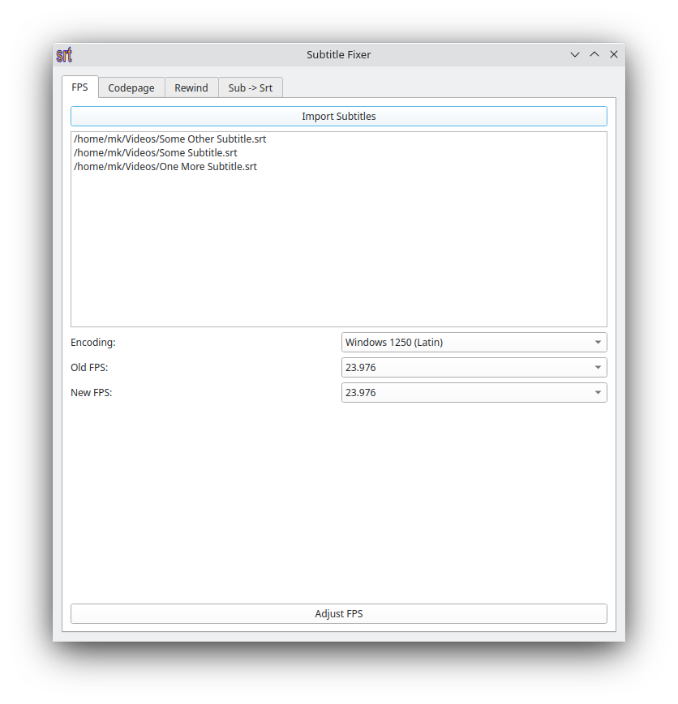
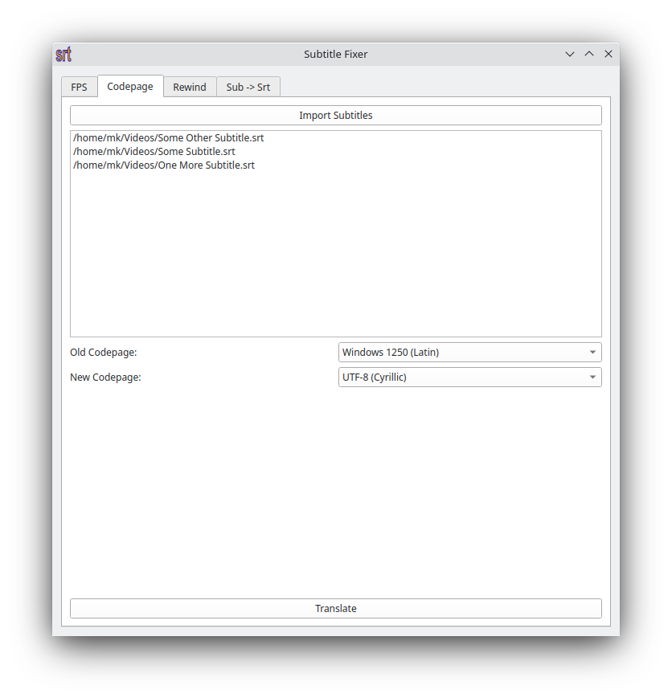

# SubFix

SubFix is cross-platform solution for subtitle (.srt and .sub) synchronization, codepage conversion (Windows 1250, Windows 1251, UTF-8) and FPS correction.

 
 

## Use cases

- UTF-8 (Cyrillic or Latin) <--> Windows 1250 (Latin) codepage conversion.
- You want to hardcode subtitle into movie. So, before rendering video, delay in subtitle must be removed first. It can be performed using 'rewind' feature.
- If subtitle author chose wrong FPS during movie translation, you can fix that using 'FPS' feature.
- .srt format is more supported than .sub, so there is .sub --> .srt conversion.

## Prerequisites

- python3
- pip3 - python3 package manager:
```bash
sudo apt-get install python3-pip
```

## Installation

Open Terminal and type:
```bash
pip3 install -r requirements.txt
```

## Running

Double-click on SubFix.py or open Terminal and type:
```bash
python3 SubFix.py
```

