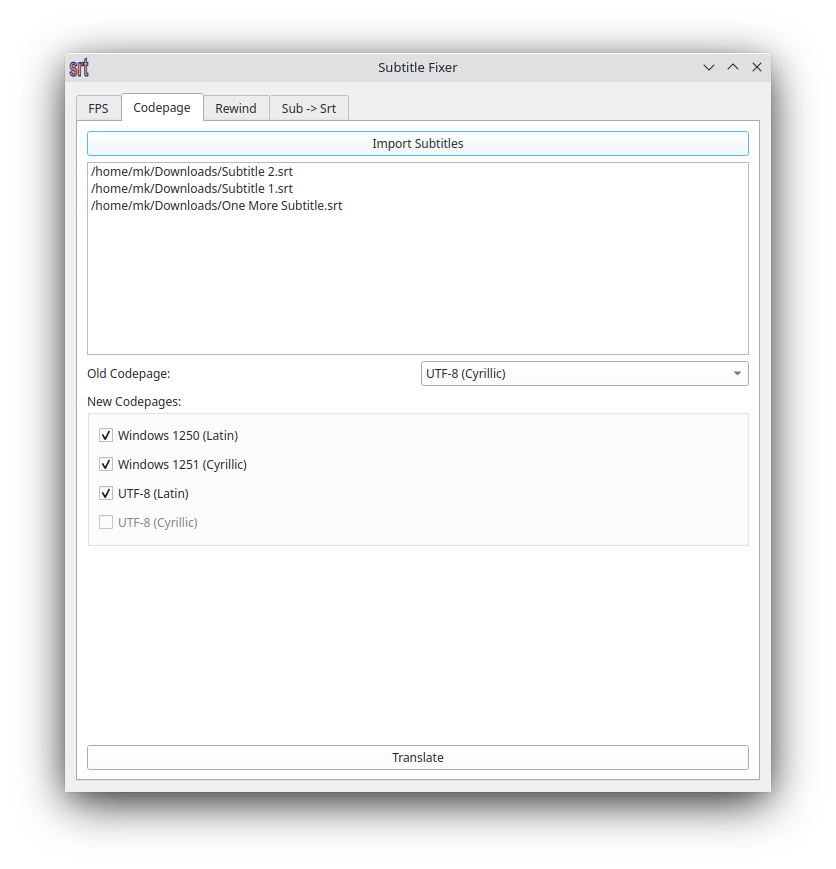
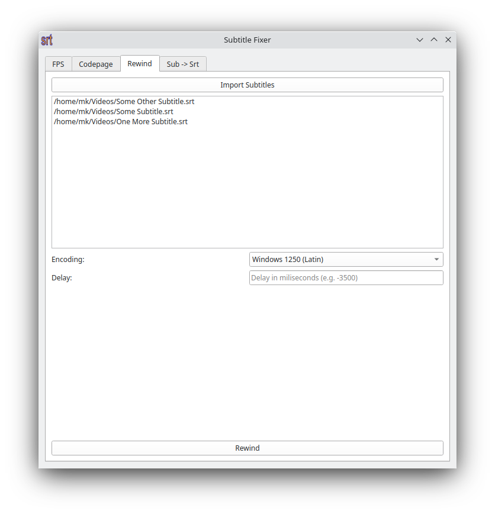

# SubFix

SubFix is cross-platform solution for subtitle (.srt and .sub) synchronization, codepage conversion (Windows 1250, Windows 1251, UTF-8) and FPS correction.

 
 

## Installation

Open Terminal and type:
```bash
pip3 install -r requirements.txt
```

